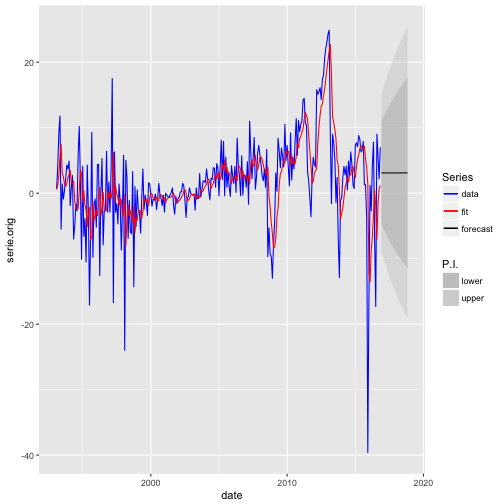

HK housing analysis
========================================================
author: Max
date: 14/01/2017
autosize: true

Subject
========================================================

This application will helps you to analyse the real estate market in HK:

- the historical figures and trends
- the stock, the renting, sales (numbers, $ figures and indice)
- forecast

For example, teh forecast for the sales is the following:

Datasource
========================================================

The data come from the HK gouvernement and can be found on https://data.gov.hk/en/

Some data have details and breakdown by district but not all:

- HK iskand
- Kowloon
_ New Territories

Some data have details and breakdown by size but not all:

- less than 40 m²
- betwwen 40 and 70 m²
- between 70 and 100 m²
- between 100 and 160 m²
- more than 160 m²

Forecast
========================================================

After analysing the historical data, we tested different forecasting model and see which one fit the best the available data.
In this case, ARIMA was the best model so we applied it to the different forecasting analysis.

Thank you
========================================================

Hope all these information will help you to make a decision between renting/buying now or waiting.
You can find the application here: https://maxxx88.shinyapps.io/hk_housing/

